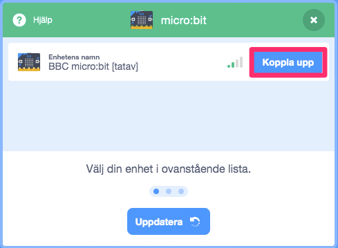

# Bugrace - micro:bit styrkontroll

I denna uppgift kommer du att få ändra i ditt Bugrace spel så att skalbaggenstyrs med hjälp av en micro:bit som handkontroll.

Om du aldrig har jobbat med micro:bit i Scratch förut, ta en titt på micro:bit uppvärmingsuppgiften först!

## 1 - Remixa ett befintligt projekt

Den här uppgiften bygger på att du har skapat ett eget Bugrace spel innan. Om du inte har gjort det kan du istället använda dig av vårt exempelprojekt:

1. Gå till ditt egna Bugrace projekt i Scratch eller till vårt exempelprojekt [https://scratch.mit.edu/projects/27697024/](https://scratch.mit.edu/projects/27697024/) om du inte har ett färdigkodat Bugrace att använda.

2. Se till att du är inloggad i Scratch och klicka på knappen **Remix** så att du får en ny version av programmet för Bug Race spel.

Nu kommer projektet öppnas i Scratch studion.

3. Ge projektet ett nytt namn. Namnet på ett projekt hittar du i mitten långt upp på skärmen.

> Det är viktigt att du remixar och får ditt nya projekt så du inte fortsätter på ett gammalt projekt! Annars sparas inte det du skapar i ditt Scratchkonto.

## 2 - Koppla upp dig mot micro:bit

De här instruktionerna förutsätter att du har installerat de nödvändiga grejorna så att Scratch kan prata med din micro:bit. Om du inte har gjort det redan- ta en titt på uppvärmingsuppgiften för att veta hur du ska göra det.

Nu ska du lägga till nya micro:bit block i Scratch, som du sen kan koda med:

1. Klicka på knappen för **Lägg till ett tillägg** längst ner till vänster i Scratch.

2. Scrolla ner i listan och klicka på bilden för **micro:bit**.

Nu kommer Scratch att automatiskt försöka hitta och ansluta till din micro:bit.

3. Klicka på **Koppla upp** när den hittat din enhet.

4. Klicka på **Gå till redigeraren** för att komma tillbaka till Scratch.

> Nu har du fått ny kategori med kodblock för micro:bit nere till vänster i listan över block. Kodblocken kan användas som vanligt för att koda tillsammans med andra block i Scratch.

## 3 - Styr skalbaggen med micro:bit

Nu är det dags att få skalbaggen att rotera och kunna svänga på banan med hjälp av micro:bit. Istället för att styra rotationen med vänster och höger piltangent på din dator ska den styras med A och B-knapparna på micro:bit, som en handkontroll.

1. Gå till koden för skalbaggen i Scratch.

2. Dra in ett micro:bit block **om knapp "A" trycks ned** till kodytan.

3. Flytta blocket **rotera 10 grader till vänster** och lägg det under micro:bit blocket.

4. Dra in ett block **om knapp "B" trycks ned** till kodytan. Flytta blocket **rotera 10 grader till höger** till det blocket.

> Testa spelet! Kan du styra skalbaggen med A- och B-knapparna på din micro:bit?

## Färdig!

Gratis, nu har du kopplat ihop dit spel med en handkontroll. Nu kan du spela ditt Bugrace spel precis som om det vore en xBox eller en Playstation.
