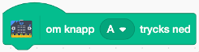

# Bugrace - micro:bit

I denna uppgift kommer du att få ändra i ditt Bugrace spel så att skalbaggen
styrs med hjälp av en micro:bit

Om du aldrig har jobbat med micro:bit i Scratch förut, ta en titt på uppvärmingsuppgiften först!

## 1 - Remixa ett befintligt project

Den här uppgiften bygger på att du har skapat ett Bugrace spel förut. Om du inte har gjort det kan du använda dig av ett exempelprojekt.

1. Gå till ditt Bugrace projekt i Scratch eller till [https://scratch.mit.edu/projects/27697024/](https://scratch.mit.edu/projects/27697024/) om du inte har kodat Bugrace

2. Klicka på knappen **Remix** så att du får en ny version av programmet

Nu kommer projekt öppnas i Scratch studion.

3. Ge projektet ett nytt namn. Namnet på ett projekt hittar du i mitten långt upp på skärmen.

> Det är viktigt att du remixar och får ditt nytt projekt så du inte fortsätter på ett gammalt projekt!

## 2 - Koppa upp dig mot micro:bit

De här instruktionerna förutsätter att du har installerat det nödvändiga grejorna så att Scratch kan prata med din micro:bit. Om du inte har gjort det - ta en titt på uppvärmingsuppgiften.

Nu ska du lägga till nya micro:bit block i Scratch, som du sen kan koda med:

1. Klicka på knappen för **Lägg till ett tillägg** längst ner till vänster i Scratch.

2. Scrolla ner i listan och klicka på bilden för **micro:bit**.

Nu kommer Scratch att automatiskt försöka hitta och ansluta till din micro:bit.

3. Klicka på **Koppla upp** när den hittat din enhet.

4. Klicka på på **Gå till redigeraren** för att komma tillbaka till Scratch.

> Nu har du fått ny kategori med kodblock för micro:bit till vänster i listan över block. Kodblocken kan användas som vanligt för att koda tillsammans med andra block i Scratch.

## 3 - Styr skalbaggen med micro:bit

Nu är det dags att få skalbaggen att rotera med hjälp av micro:bit. Istället för att styra rotationen med vänster och höger piltangent ska den styras med A och B-knapparna på micro:bit

1. Gå till koden för skalbaggen

2. Dra in ett block **om knapp "A" trycks ned** till kodytan.

3. Flytta blocket **rotera 10 grader till vänster** och lägg det under microbit:blocket

<video src="./mov_1.mp4" autoplay loop muted />

4. Dra in ett block **om knapp "B" trycks ned** till kodytan och flytta blocket **rotera 10 grader till höger** till det blocket.

> Testa spelet! Kan du styra skalbaggen med A- och B-knapperna på micro:bit

## Färdig!

Gratis, nu har du kopplat ihop dit spel med en handkontroll precis som till ett xBox eller en Playstation.
