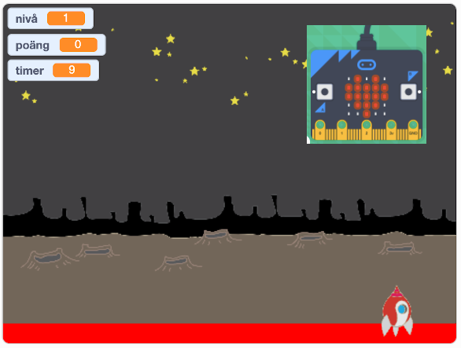

# Rymdattack - micro:bit

I denna uppgift kommer du att få ändra i ditt skapade Rymdattack spel så att rymdskeppet
styrs och att du skjuter skott med hjälp av en micro:bit som handkontroll.

Om du aldrig har jobbat med micro:bit i Scratch förut, ta en titt på uppvärmingsuppgiften först!

## 1 - Remixa ett befintligt project

Den här uppgiften bygger på att du har skapat ett Rymdattack spel förut. Om du inte har gjort det kan du använda dig av ett exempelprojekt.

1. Gå till ditt Rymdattack projekt i Scratch eller till [https://scratch.mit.edu/projects/118440149/](https://scratch.mit.edu/projects/118440149/) om du inte har kodat Rymdattack

2. Klicka på knappen **Remix** så att du får en ny version av programmet

Nu kommer projektet öppnas i Scratch studion.

3. Ge projektet ett nytt namn! Namn på projekt hittar du i mitten långt upp på skärmen. Byt ut det som står till ett eget namn.

> Det är viktigt att du remixar och får ditt nytt projekt så du inte fortsätter på ett gammalt projekt! Då kan det bli fel.

## 2 - Koppa upp dig mot micro:bit

De här instruktionerna förutsätter att du har installerat din micro:bit med de nödvändiga grejorna så att Scratch kan prata med din micro:bit. Om du inte har gjort det - ta en titt på uppvärmingsuppgiften om hur man installerar.

Nu ska du lägga till nya micro:bit block i Scratch, som du sen kan koda med:

1. Klicka på knappen för **Lägg till ett tillägg** längst ner till vänster i Scratch.

2. Scrolla ner i listan och klicka på bilden för **micro:bit**.

Nu kommer Scratch att automatiskt försöka hitta och ansluta till din micro:bit.

3. Klicka på **Koppla upp** när den hittat din enhet.

4. Klicka på på **Gå till redigeraren** för att komma tillbaka till Scratch.

> Nu har du fått en ny kategori med kodblock för micro:bit nere till vänster i listan med kodblock. Kodblocken kan användas som vanligt för att koda tillsammans med andra block i Scratch.

## 3 - Styr rymdskeppet med micro:bit

Nu är det dags att få rymdskeppet att förflytta sig med hjälp av micro:bit som handkontroll. Istället för att styra rymdskeppets rörelser med vänster och höger piltangent på datorn ska den styras genom att luta micro:biten åt höger och vänster. Gör såhar:

1. Gå till koden för rymdskeppet i Scratch.

2. Hitta **för alltid**-loopen som styr rymdskeppets rörelse. Den bör se ut ungefär som i bilden nedan.

3. Ta bort de två **om**-satserna, men lämna kvar blocket som gör att rymdskeppet studsar vid kanten i loopen.

Micro:biten kan känna av om du lutar på den och i vilken riktigt du lutar den. Här ska vi använda oss av **lutningen till vänster** som kan vara *0*, *mindre än 0 (<0)* eller *större än noll (>0)*.

Värdet på **lutningen** illustreras i denna bild (där *0* är antal grader på lutningen):

Det här ska vi nu använda för att förflytta rymdskeppet i spelet. Gör såhär:

4. Dra in ett block **ändra x med "10"** och lägg den innanför **för alltid**-loopen.

5. I stället för värdet **10** drar du in ett block from micro:bit kategorin som heter **luta riktning "vänster"**

> Testa spelet! Kan du styra rymdskeppet genom att luta på micro:biten?

Om du gjort som instruktionerna ovan kommer troligtvis rymdskeppet att röra på sig för fort. Det kan vi fixa genom att *skala ner* lutningen.

6. Ändra koden så att **ändra x med** blocket har värdet **0.1** * **luta riktning vänster**

Här använder vi oss av en **operator** för att göra förändringen i **x** mindre!

> Testa spelet igen! Rör sig rymdskeppet lagomt snabbt?

## 4 - Skjut skott med micro:bit

Nu ska du få koda så att du också kan skjuta iväg skott med micro:bit.

1. Gå till koden för skottet

2. Dra in ett block **om knapp "A" trycks ned** till kodytan.

3. Flytta all kod som är under blocket **när "mellanslag" tangenten trycks ned** till micro:bit blocket.

> Testa spelet! Kan du skjuta med A-knappen på micro:bit?

## Färdig!

Grattis, nu har du kopplat ihop dit spel med en handkontroll. Nu kan du spela ditt Rymdattack spel precis som om det vore en xBox eller en Playstation.
