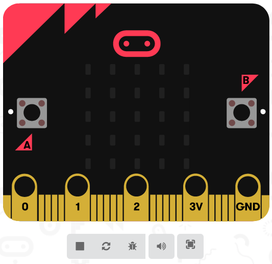
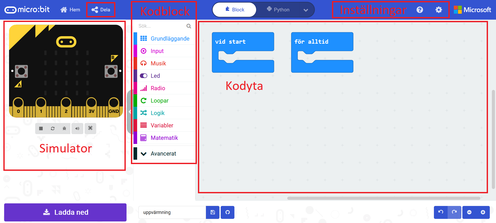
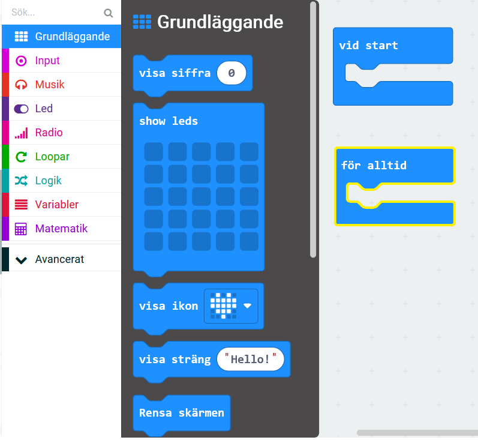
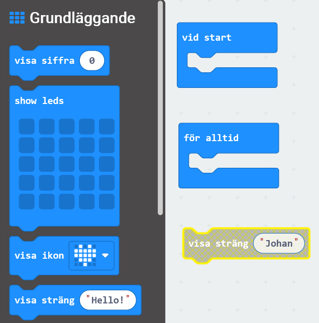
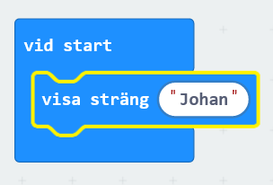
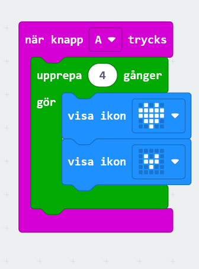

# micro:bit uppvärmning

Denna uppgift är för dig som aldrig har kodat med micro:bit förut och vill ha en snabbstart innan du börjar koda ett riktig program. 123

## 1 – Kom igång med micro:bits

Här kommer några tips för att komma igång med din micro:bit.

### Hitta till micro:bit editorn

För att koda program till din micro:bit gå till denna adress

[https://makecode.microbit.org](https://makecode.microbit.org)

### micro:bit editorn

Editorn är indelat i tre stora delar

1. Till höger finns kodytan där du bygger upp din kod

2. I mitten hittar du alla kodblock som behöver i olika kategorier

3. Till vänster hittar du en simulator där du kan testa din kod innan du kopierar över den till din micro:bit

Det finns också två andra knappar som kan vara bra att känna till

* Om du klickar på kugghjulet i övre delen av fönstret så hittar du inställningar där du bland annat kan ändra **språket** till svenska

* En **dela knapp** som gör att du kan dela med dig av din kod till kompisar

### Föra över program till micro:biten

När du har skapat ett program i editorn behöver du flytta över den till micro:biten. Det gör du genom att

1. Namnge projektet

    

2. Klicka på "Ladda ned"-knappen. Vilket gör att en liten fil med ändelsen **hex** laddas ner till din dator.

    

3. Koppla in micro:biten till datorn med hjälp av en USB kabel

4. Flytta **hex**-filen till micro:biten

    > Om du har svårt att veta hur du ska flytta över filen till micro:biten, fråga en vuxen!

## 2 - Visa ditt namn

Det första du ska få koda är att ditt namn ska dyka upp på micro:biten när du startar den.

1. Klicka på kategorin **Grundläggande**

    

2. Dra in ett block **visa sträng...** till kodytan och byt ut **Hello!** mot ditt eget namn.

    

3. Det finns redan två kodblock på kodytan som inte går att ta bort. Ett block som körs när programmet startar och ett block som alltid kör en loop.

4. Dra in blocket **visa sträng...** innanför blocket **vid start**

    

> **Testa!** Du kan testa ditt spel med hjälp av simulator till vänster i fönstret. Klicka på knappen  för att startar om simuleringen om texten redan försvunnit.

> **Ladda ner spelet!** Döp spelet till **namn** och klicka på **"Ladda ner"** för sedan över filen med programmet till micro:biten med en USB-kabel. Syns ditt namn på micro:biten när den startar?

## 3 – Använd knapparna

På micro:biten finns det två knappar **A** och **B**. Nu ska du få koda vad som ska hända när du trycker på dem.

1. Klicka på kategorin **Input**

    

2. Dra in ett block **när knapp A trycks** till kodytan

    > Vad ska hända när du trycker på knapp A? Här visar vi hur du kan skapa en enkel animation – men du får koda vad du vill! Du kan till exempel göra så att micro:biten visar temperaturen.

3. Dra in ett block **upprepa 4 gånger** från kategorin **Loopar** och lägg det innanför blocket som körs när du trycker på knapp **A**

4. Lägg in dessa två block innanför loopen:

    * Visa ikon **Hjärta**

    * Visa ikon **Litet hjärta**

    **Visa ikon** hittar du under kategorin **Grundläggande**

    

**Tips!** du kan också rita dina egna bilder med blocket **visa lysdioder**

> **Testa!** Du kan testa ditt spel med hjälp av simulator till vänster i fönstret. Klicka på den lilla cirkeln ovanför **A**.

> **Ladda ner spelet!** Döp spelet till **knappA** och klicka på **"Ladda ner"** för sedan över filen med programmet till micro:biten med en USB-kabel. Vad händer om du trycker på knapp A?

## Färdig!

Grattis, nu är du redo att koda ett riktigt program med din micro:bit.
