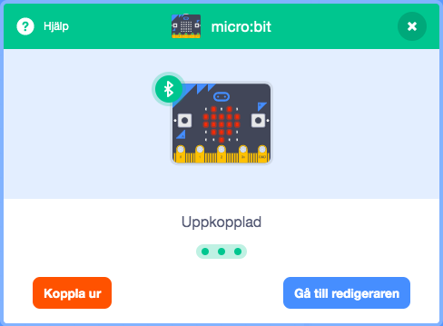
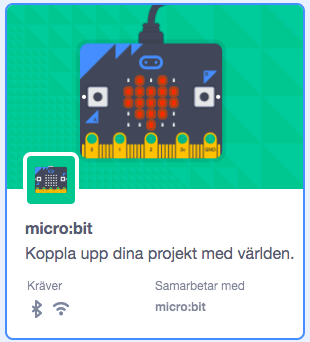
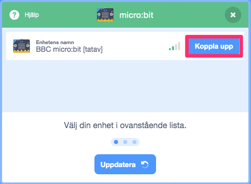
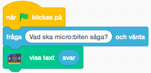
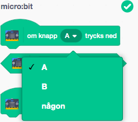
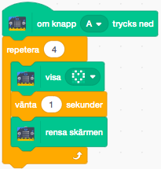
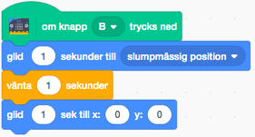

# micro:bit uppvärmning med Scratch

Denna uppgift är för dig som aldrig har kodat med micro:bit förut och vill ha en snabbstart innan du börjar koda ett riktig program. Du kommer att få lära dig att styra din micro:bit med Scratch!

## 1 – Kom igång med micro:bits

För att kunna använda micro:bit med Scratch behöver du installera några saker.

1. Gå till [https://scratch.mit.edu/microbit](https://scratch.mit.edu/microbit) och gör instruktionerna där

Du behöver i korthet:

* Installera ett litet program på din dator

* Kopiera över en .hex-fil till din micro:bit

* Starta programmet *Scratch Link* som du installerade

## 2 - Visa ett meddelande på micro:biten

Det första du ska få göra är att fråga efter ett kort meddelande som ska visas på micro:bit

Vi ska börja med att lägga till micro:bit block:

1. Klicka på knappen för **Lägg till ett tillägg** längst ner till vänster på skärmen

2. Scrolla ner i listan och klicka på **micro:bit**

Nu kommer Scratch att försöka hitta och ansluta till din micro:bit

3. Klicka på **Koppla upp** när den hittat din enhet

4. Klicka på på **Gå till redigeraren** för att komma tillbaka till Scratch-editorn.

Nu har du fått nya block till vänster i listan över block.

Skapa ett skript som säger:

1. När **Start klicka på**

2. **Fråga** "Vad ska micro:bit en säga?" och vänta

3. **visa text** "svar"

Det sista blocket är ett av de nya micro:bit-blocken.

> Testa ditt program. Vad händer när du klickar på den gröna flaggan?

## Använda knapparna

På micro:biten finns det två knappar **A** och **B**. Nu ska du få koda vad som ska hända när du trycker på dem.

1. Du har ett micro:bit block som heter **om knapp A trycks ned**. Du kan också välja **B** eller **någon** knapp (A eller B)

2. Dra in ett block **om knapp A trycks ned** till kodytan

    > Vad ska hända när du trycker på knapp A? Här visar vi hur du kan skapa en enkel animation – men du får koda vad du vill!

3. Dra in ett block **repetera 4 gånger** från kategorin **Kontroll** och lägg det innanför blocket som körs när du trycker på knapp **A**

4. Lägg in dessa block innanför loopen:

    * **Visa** ikon **Hjärta**

    * **Vänta** 1 s

    * **Rensa** skärmen

> Testa ditt program! Vad händer om du trycker på A-knappen på micro:biten?

Du kan ju också få sprajter i Scratch att röra på sig!

Skapa ett Script som säger:

1. Om **knapp B** trycks ned

2. **Glid** 1 sekund till **slumpmässig position**

3. **Vänta** 1 sekund

4. **Glid** 1 sekund till **x: 0 y:0**

> Testa ditt program! Vad händer om du trycker på B-knappen på micro:biten?

## Färdig!

Grattis, nu är du redo att koda ett riktigt program med din micro:bit.
